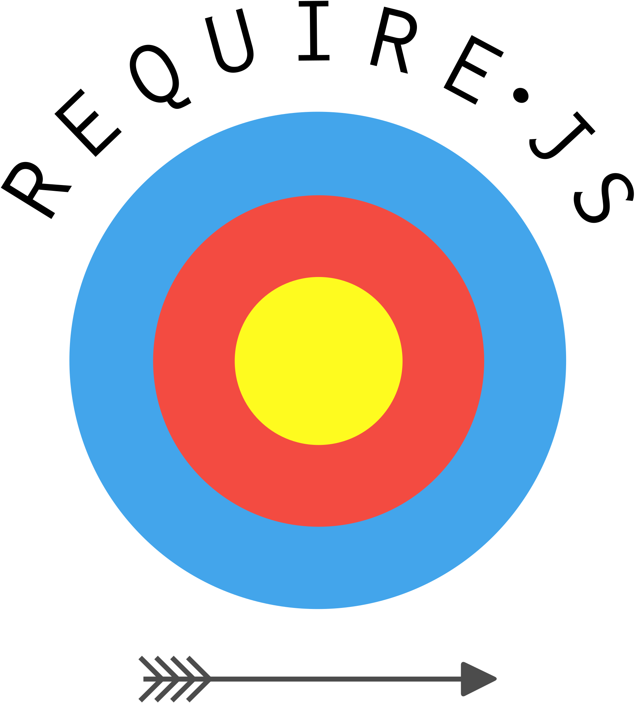

class: center, middle, inverse
# IQ's JavaScript tool chain.

What tools do we use, and why ?

---

# How client-side web development evolved ?

### 1996 ~ Old school website, no tools
How bad was it ?

### 2010 ~ Single page applications, require.js
IQ a few months ago

### 2015 ~ Bundled JavaScript, webpack
Our current solution

---
class: center, middle, inverse

# The old school website

---

# Old school website

- No tools
- Plain HTML & JS

```html
<!-- index.html -->
<html>
  <head>
    <script type="text/JavaScript" src="index.js" />
  </head>
  <body>...</body>
</html>
```

```js
// index.js
console.log('Hello world')
```

.arrow[
- How to add a library ?
]

---

# Add a library, the old school way

1. Download it
2. Put it in a script folder
3. Add it to the page

```html
<!-- index.html -->
<html>
  <head>
    <!-- Dependencies -->
    <script src="script/jquery.js" />
    <script src="script/jqueryPlugin.js" />
    <script src="script/toastr-2.1.2.js" />
  </head>
  <body>...</body>
  <!-- Main program -->
  <script type="text/JavaScript">
    toastr.success('Hello world')
  </script>
</html>
```

--

It's simple, but has major downsides.

---

# The problems with old school JS

.topmargined[
```html
<!-- index.html -->
<html>
  <head>
    <!-- Dependencies -->
*   <script src="script/jquery.js" />       // define 'jQuery' in the global namespace
*   <script src="script/jqueryPlugin.js" /> // add 'plugin' to 'jQuery'
*   <script src="script/toastr-2.1.2.js" /> // use '$.plugin' and define 'toastr'
  </head>
  <body>...</body>
  <!-- Main program -->
  <script type="text/JavaScript">
    toastr.success('Hello world')
  </script>
</html>
```
]

---

# The problems with old school JS

### Dependency management
.bad[
- Dependencies are added to the source control
- Installation and updates are manual
- Keeping track of dependencies versions is a nightmare
]

### Network
.bad[
- Each JS file is loaded in its own http request
- Not the best usage of the browser cache
]

### Language
.bad[
- `<script>` are loaded in the global namespace
- `<script>` must be loaded in the correct order
]

---
# The Revealing Module Pattern

There used to be various workarounds, like the "Revealing Module Pattern", to avoid namespacing conflicts...

```js
// Merge an existing 'namespace' with an empty one {}
var namespace = namespace || {};

// here a namespace object is passed as a function parameter (o),
// where we assign public methods and properties to it
(function (o) {
  o.foo = "foo"
  o.bar = function () {
    return "bar"
  }
}) (namespace)
```
...until the rise of modular JavaScript a few years later.
---
class: center, middle, inverse

# Modular JavaScript
How to fix the namespacing problems ?
---
# What is a module ?

In JavaScript, the word "modules" refers to small units of independent, reusable code.
- highly self-contained with a distinct functionality
- can be a dependency to another module
- brings better maintainability and reusability
- allows namespacing

--
### Three module format exist

| Name | Short | Loading | Usage | Year |
|:---|:---|:---|:---|:---|
| Asynchronous Module Definition | AMD | Asynchronous | Browser | 2011 |
| CommonJS                       | CJS | Synchronous  | Server | 2009 |
| ECMAScript Module              | ESM | Both         | Both   | 2014 |

--
.arrow[
Since we focus on the client-side, let's start with AMD.
]
---
# Asynchronous Module Definition (AMD)

The specification defines a single function **define** that is available as a global variable.

```js
define(id?, dependencies?, factory);
```

- **id**, *optional*: Name of the module being defined
- **dependencies**, *optional*: An array literal of the module ids that are dependencies
- **factory**: A function that should be executed to instantiate the module or an object

--

This function will:

1. Load all the dependencies asynchronously
2. Pass them to the factory function
3. Define a module with the result of that factory

--

```js
// Calling define with a dependency array and a factory function
define(['dep1', 'dep2'], function (dep1, dep2) {
  // Define the module value by returning a value.
  return function () {};
});
```
---
# AMD recap.

Modularization solves both previous language problems:
.good[
- Each module has its own namespace
- Dependencies are loaded on demand
]

There is much more to say about the [AMD API](https://github.com/amdjs/amdjs-api/wiki/AMD), but it's out of scope.
---
class: center, middle, inverse
# Former IQ's solution
RequireJS + Nuget
---
.logo.right.absolute[]
# Using RequireJS to load AMD modules
.col-double[
RequireJS is a JavaScript file and module loader, and one of the most popular implementations of AMD.
]
.col-double[
RequireJS is configurable, the configuration will allow us to:
- Follow modules version
- Rename / remap module names
- Assign different names for different versions of a module
]
```js
requirejs.config({
  map: {
    '*': {
      'foo': 'foo1.2'
    },
    'some/oldmodule': {
      'foo': 'foo1.0'
    }
  }
});
```
---
# Let's modularize our example...
.grid[.g_col1[
Before
```html
<!-- index.html -->
<html>
  <head>
    <script src="script/jquery.js" />
    <script src="script/jqueryPlugin.js" />
    <script src="script/toastr-2.1.2.js" />
  </head>
  <body>...</body>
  <script type="text/JavaScript">
    toastr.success('Hello world')
  </script>
</html>
```
].g_col2[
After
```html
<!-- index.html -->
<html>
  <body>...</body>
  <script data-main="index" src="script/require.js" />
</html>
```
- RequireJS is the only loaded script, index.html is now a view template.
- the `data-main` element is the entry point for the application
- `data-main="index"` refers to `index.js`
]]

---
# ...Let's modularize our example
.grid[.g_col1[
```js
// index.js
// Dependency declarations
var main = requirejs.config({
  baseUrl: 'script',
  paths: {
    jquery: 'jquery-1.9.10',
    jqueryPlugin: 'jqueryPlugin-1.1',
    toastr: 'toastr-2.1.2'
  },
  shim: {
    'jqueryPlugin': {
      deps: ['jquery']
    }
  }
});

// Main program
main(['toastr'], function (toastr) {
  toastr.success('Hello world');
});
```
]
.g_col2[
### 1. Configuration
- dependencies are loaded from the `script` directory
- dependency names are associated with a path
- the `shim` section defines dependencies for non-modular dependencies

### 2. Execution
- `requirejs.config({...})` produces a `main` function
- the `main` function requires `toastr` and uses it.
]]

---

# Using Nuget to resolve JavaScript dependencies

In the IQ solution, Nuget was used to resolve all the dependencies.

Believe it or not, Nuget packages exist to add JavaScript dependencies like jquery and require.js.

Installing such packages will extract `.js` file(s) to the project's `script` folder.

--

This solution solves two problems:
.good[
- Installations are automated
- Dependencies versions are managed
]
With the following limitations:
.bad[
- Dependencies are added to the source control*
- Not all JavaScript dependencies exist in Nuget
- The project `script` folder is a mess
]

.footnote[.red.bold[*] Because of the way we build our solution.]

---

# IQ former solution recap

.grid[.g_col1[.good[
- Dependency installations are automated
- Dependencies versions are managed
- Each module has its own namespace
- Dependencies are loaded on demand
]].g_col2[.bad[
- Dependencies are added to the source control
- We need to configure our dependencies mapping
- Not all JavaScript dependencies exist in Nuget
- The project `script` folder is a mess
- RequireJS doesn't work well with CJS modules
- Each JS file is loaded in its own http request
- Not the best usage of the browser cache
]]]

--
.no_margin_top[
## Why change ?
]

The verification team reported occurences of outdated JavaScript in the page.

The deal breaker here is a networking problem:
.bad[
- Not the best usage of the browser cache
]
.arrow[
- We need to gain **more control on the browser cache**.
]

---

# How to improve our cache usage ?

This topic would need a dedicated presentation, more details can be found on [developers.google.com](https://developers.google.com/web/fundamentals/performance/optimizing-content-efficiency/http-caching).

What we want from a cache is:
- The longest possible retention of the cached resources
- A reliable invalidation of old resources

--

To achieve theses objectives, we chose to use content hashes.

For example, `SystemHealth.js` will be renamed `SystemHealth.b44e3c234f23a.js`, `b44e3c234f23a` being the hash of the content of the file.

.good[
- `SystemHealth.b44e3c234f23a.js` can stay in the browser cache forever
- If anything changes in the source code, the filename will change and become a new cache entry
]

--

.arrow[
- We need new tools to rename our JavaScript files.
]

---

class: center, middle, inverse
# Meanwhile, on the server-side...

---

# The rise of server-side JS

In 2009, a project named **CommonJS** was started with the goal of specifying an ecosystem for JavaScript outside the browser.
CommonJS is a growing collection of standards, including:

- Modules system
- Local and remote packages and package management
- Standard library
- Unit test assertions, running, and reporting
- Web server gateway interface, JSGI

The most well-known implementation of CommonJS is...

--

.center.logo[]

.arrow[
- node.js is the runtime evironment of a lot of JavaScript tools, including **package managers** and **build systems**.
]

---

# JavaScript package managers

.container[
  

  

  
]

They exist since 2010

- **Bower** reached its popularity peak in 2013
- **npm** appeared in 2010 (node package manager) and has been the most popular since 2015
- **Yarn** appeared in 2016 and is getting some traction

Yarn is compatible with npm, both of them can be used concurrently.

---

# Package manager trends

.chart[]
.arrow[
- We use npm on IQ
]

---

# JavaScript build systems
.grid[.g_col1.g_row1[
### tasks runners

- Grunt (2012 - 2016) was the pioneer of the front-end build systems
- Gulp appeared in 2013 and is still in development
].g_col2.g_row1[
.container[
  

  
]
].g_col1.g_row2[
### build systems

- webpack was first released in 2014
- Rollup is the new kid on the block
].g_col2.g_row2[
.container[
  

  
]
]]

---

# Build system trends

.chart[]
.arrow[
- We use webpack on IQ
]

---

class: center, middle, inverse
# Bundled JavaScript
Our current solution

---

# Our current solution

Today's solution is based on:
- **npm** as a package manager
- **webpack** as a build system

---

layout: true
# .logo_small[]

---

npm is:
- A command line tool
- Installed globally with node.js

npm does:
- Manage dependencies
- Set the project up
- Run user scripts

Npm produces a `package.json` file at the project root folder.

This file is the equivalent of `.csproj` file and a `packages.xml` file.


Most common npm commands:
```js
install, uninstall // add or remove dependencies
run, test          // execute user defined scripts
outdated, update   // handles dependencies upgrade
```

---

### Project setup

We initialize our project by typing

```
project_dir$ npm init
```

After asking us a bunch of question, it will creates a `package.json` file.

```json
// package.json
{
  "name": "jstools",
  "version": "1.0.0",
  "description": "",
  "main": "index.js",
  "scripts": {
    "test": "echo \"Error: no test specified\" && exit 1"
  },
  "author": "",
  "license": "ISC"
}
```

---

### Adding a dependency

We add a library to our project by typing

```
project_dir$ npm install --save toastr
```

The library will be downloaded in the `node_modules` directory and the `package.json` file will be updated.

```json
// package.json
{
  ...
* "dependencies": {
*   "toastr": "^2.1.2"
* }
}
```

---

### Recap.

.good[
- ~~Not~~ All JavaScript dependencies exist in ~~Nuget~~ npm
- The project's ~~`script`~~ `node_modules` folder is ~~a mess~~ managed by npm
]

For JavaScript dependencies, npm is the de facto standard.
Everything you might need is available on npm.

.star[
- Build environments include node.js and npm
]

---

layout: true
# .logo_small[] webpack

---

webpack is also a command line tool that can be installed globally.

The best practice is to install it locally to the project and run it via a npm user script.

### Core feature
webpack is a **module bundler** for modern JavaScript applications.

webpack does:
1. Reads an **entry** module and parse its dependencies,
2. recursively builds a dependency graph of all the modules,
3. packages all of those modules into a bundle.

.star[
- We don't need to configure our dependencies mapping any more
]

---

### Loaders

Loaders enable webpack to process more than just JavaScript files (webpack itself only understands JavaScript).

Sample of `webpack.config`
```js
  module: {
    loaders: [
      ...,
      { test: /\.css$/, loader: 'style-loader!css-loader' },
      { test: /\.png$/, loader: 'url-loader?limit=100000' },
      { test: /\.jpg$/, loader: 'file-loader' },
      { test: /\.ttf$/, loader: 'file-loader' }
    ]
  }
```

Loaders are npm packages, installed as dependencies.

---

### Loaders can be used to process resources

- JavaScript
  - **eslint-loader**: check the source files according to the project's linting rules,
  - **babel-loader**: transpile ECMAScript 6/7, TypeScript and `.jsx` to ECMAScript 5 for legacy browsers.
- Styles
  - **less-loader** & **sass-loader**: compiles less/sass to css,
  - **postcss-loader**: adds vendor prefixes to css rules.
- Images
  - **image-webpack-loader**: minimize images size,
  - **svg-url-loader**: inline SVG in base64 and gzip it.
- Frameworks
  - **vue-loader** & **ng-loader**: loads `.vue`/`.ng` files,
  - **react-hot-loader**: enable hot reloading for react components.
- Fonts, yaml, coffee, istanbul...

.arrow[
- If you need something, there is a loader for it.
]

---

### Plugins

While loaders are used to transform certain types of modules, plugins can be leveraged to perform a wider range of tasks. Plugins range from bundle **optimization** and **minification** all the way to **defining environment-like variables**.
.center[
| Name | Description |
|:---|:---|
| HtmlWebpackPlugin | Easily create HTML files to serve bundles |
| CommonsChunkPlugin | Extract common modules shared between chunks |
| IgnorePlugin | Exclude certain modules from bundles |
| CleanWebpackPlugin | Clean the output directory before each build |
| WebpackNotifierPlugin | Windows notification in watch mode |
*Plugins used on IQ*
]

.arrow[
- The scope of a plugin is the whole project while the scope of a loader is a module.
]

---

### Recap.

Our initial goal was to gain control on the browser cache.

.good[
- The produced bundles are tagged with a content-hash,
- loading a few big bundle is much faster than a lot of very small files,
- webpack can load all module formats, we didn't had to rewrite anything,
- we don't need to configure our dependencies mapping any more.
]

Bonuses to the developper experience:

.star[
- We can use the latest language features, such as `aync/await` and still support IE,
- the code is automaticaly linted,
- webpack automaticaly re-built in *watch mode*.
]

But it wasn't free: REWORD THIS

.bad[
- With the XAML build system, we had to tweak our csproj to include produced artefacts in the build output, vnext integrate webpack,
- integrate webpack in an existing project needed some extra configuration.
]

---
layout: false

# Conclusion

#### Dependency management
.good[
- Dependency installations are automated
- Dependencies' versions are managed
]
.bad[
- Dependencies are still added to the source control (compressed in node_modules.7z)
]

#### Network
.good[
- Each bundle is content tagged,
- loading a few big bundle is much faster than a lot of very small files.
]

#### Language
.good[
- Each module has it's own namespace
- Dependencies are loaded on demand
- Latest language features
]
